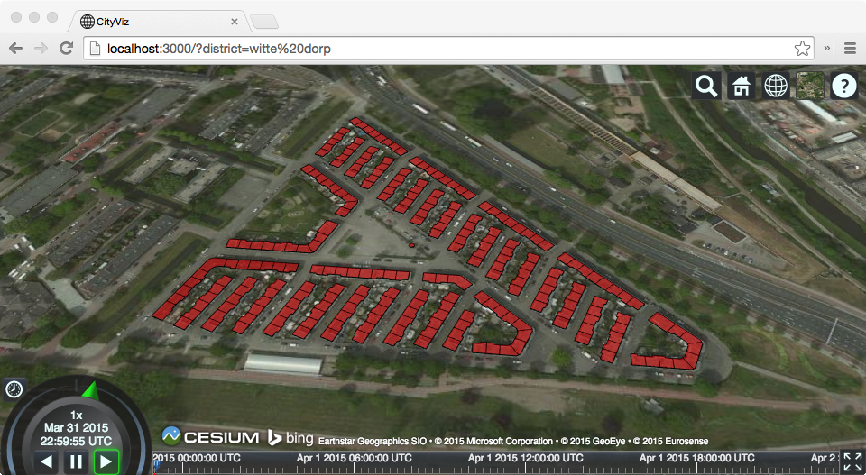

# CityViz




## Getting Started

1. Clone repository from
	[github.com/adius/CityViz](https://github.com/adius/CityViz) like this:
	```sh
	git clone https://github.com/adius/CityViz
	```
1. Run `$ npm install` to install all dependencies
1. In order to make the `cityviz` command available on your machine
   run following command in the CityViz root directory:

   ```sh
   npm link
   ```
   
   In order to get an overview over available sub-commands you can 
   simply run `cityviz` without any parameters.


### 3DCityDb 2.1 based version

1. Start postgres server
1. Run `cityviz setup` to create the CityViz database.
	The newly created database has following properties:
	- name: cityviz
	- user: cityviz
	- password:  cityviz
	If you want to have different database-settings, make sure to update
	those in [config.yaml](./config.yaml).
1. If you encounter any problems during setup,
	drop the CityViz database first with `cityviz dropdb` and try again.
1. Run `cityviz import <citygml-file|directory>` to import specified files
	Attention: Although the script reports that the import was successful it
	might not contain any data.
	[Investigation on this issue](https://github.com/3dcitydb/3dcitydb/issues/3)
	Alternatively you can import data with the graphical version of the
	[3DCityDb-importer-exporter 1.6](http://www.3dcitydb.org/3dcitydb/d3dimpexp)
	
Please checkout [test/export.js](./test/export.js)
for the export to collada and the conversion to gltf


### RethinkDB based version

1. Install RethinkDB
	On Mac with hombrew: `brew update && brew install rethinkdb`
1. Start RethinkDB by executing `rethinkdb` in your command line
1. Use the admin interface on [localhost:8080](http://localhost:8080)
	to manage the database.
1. Import citygml files into your database by running:
   
   ```sh
   cityviz rdb-import <gml file | directory of gml files>
   ```
1. Run `node app.js` to start the application server

The server now exposes several endpoints:
	
[localhost:3000/cityObjects](http://localhost:3000/cityObjects)

Get all cityObjects from the database as JSON-array.
To limit the number of cityObjects use the endpoint like this:
[localhost:3000/cityObjects/1000](http://localhost:3000/cityObjects/1000)

The query parameter "type" can be used to get the data [buffered]
(http://localhost:3000/cityObjects?type=buffered) or as 
[event-stream](http://localhost:3000/cityObjects?type=event-stream)
(default is streamed)


Open [localhost:3000](http://localhost:3000) in your Browser to get a 
interactive webgl globe including renderings of the ground-surfaces of
all buildings in your database.
(Attention: This might crash when you have too many (~ >50000)
cityObjects in your database)

The query parameter "numberOfCityObjects" can be used to limit the number of
cityObjects to be rendered: 
[localhost:3000?numberOfCityObjects=500](http://localhost:3000?numberOfCityObjects=500)

This uses the streaming version of the cityObjects endpoint in a buffered way.
Clients for the streaming api and for the event-stream api
which leverage streaming are work in progress
in the [app/js/index.js](./app/js/index.js) file.


## Detailed Installation

This should be used if you want to use the official GUIs and execute the 
3DCityDb setup process manually instead of using the 
bundled version (not recommended).

On Mac:

1. Install [postgresapp](http://postgresapp.com)
	(Already contains PostGIS plugin which otherwise
	would have to be installed as well)
1. Follow the instructions on [postgresapp.com/documentation
	](http://postgresapp.com/documentation/cli-tools.html) to add the `psql`
	command to your command line.
1. Download [3DCityDB 2.1](http://www.3dcitydb.org/3dcitydb/downloads)
1. Run setup.jar to install 3DCityDB
1.
	- Create a new database in postgres
		(You can use [pagadmin](http://pgadmin.org) to inspect and interact
		with your database.)
	- Enable the postgis extension for it by
		right clicking Extensions > name: postgis > OK.
1. Open `/Applications/3DCityDB-Importer-Exporter/3dcitydb/postgis/CREATE_DB.sh`
	with a text-editor and adapt the exported variables to your settings.

	Then create the necessary schemas and tables by executing this shell-script.
	(For the Rotterdam model use SRID: 28992 and name EPSG: 28992)
1. Open the 3D City Database Importer/Exporter by executing
	`/Applications/3DCityDB-Importer-Exporter/3DCityDB-Importer-Exporter.sh`
	and connect to the database
1. Import your files with the Importer/Exporter.


## Links

- [rmx/collada-converter](https://github.com/rmx/collada-converter) -
	A library for converting COLLADA files to a format suitable for WebGL
- [rmx/threejs-collada](https://github.com/rmx/threejs-collada)
- [KhronosGroup/glTF](https://github.com/KhronosGroup/glTF)
- [f4map](http://f4map.com)
- [lo-th.github.io/3d.city](http://lo-th.github.io/3d.city)
- [https://github.com/mrdoob/three.js/issues/5708](mrdoob/three.js/issues/5708)
- [arcgis](https://arcgis.com) -
	Gives everyone in your organization the ability to discover,
	use, make and share maps.

### Gltf

- [mason.gmu.edu/~bcoughl2/cs752](http://mason.gmu.edu/~bcoughl2/cs752) -
	3D for the Modern Web: Declarative 3D and glTF

### Viewer

- [glge](http://glge.org)
- [senchalabs.org/philogl/demos](http://senchalabs.org/philogl/demos.html)
- [scenejs](http://scenejs.org)
- [mapbox/mapbox-gl-js](https://github.com/mapbox/mapbox-gl-js)
- [evanw/lightgl.js](https://github.com/evanw/lightgl.js)


### WebGL Resources

- [learningwebgl.com](http://learningwebgl.com)
- [webacademy.com](http://learningwebgl.com)


### Coordinates

- [Projection Service](http://resources.arcgis.com/en/help/rest/apiref/project.html)
